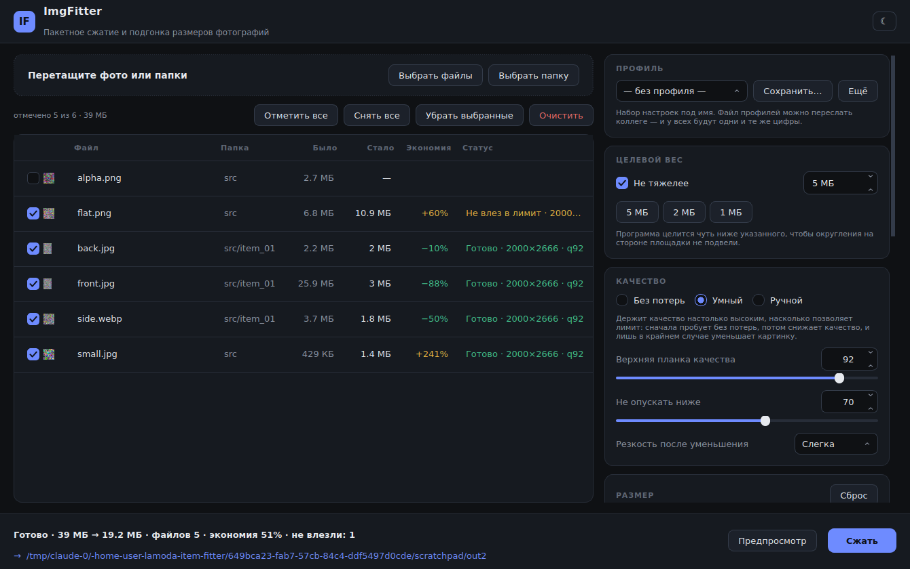
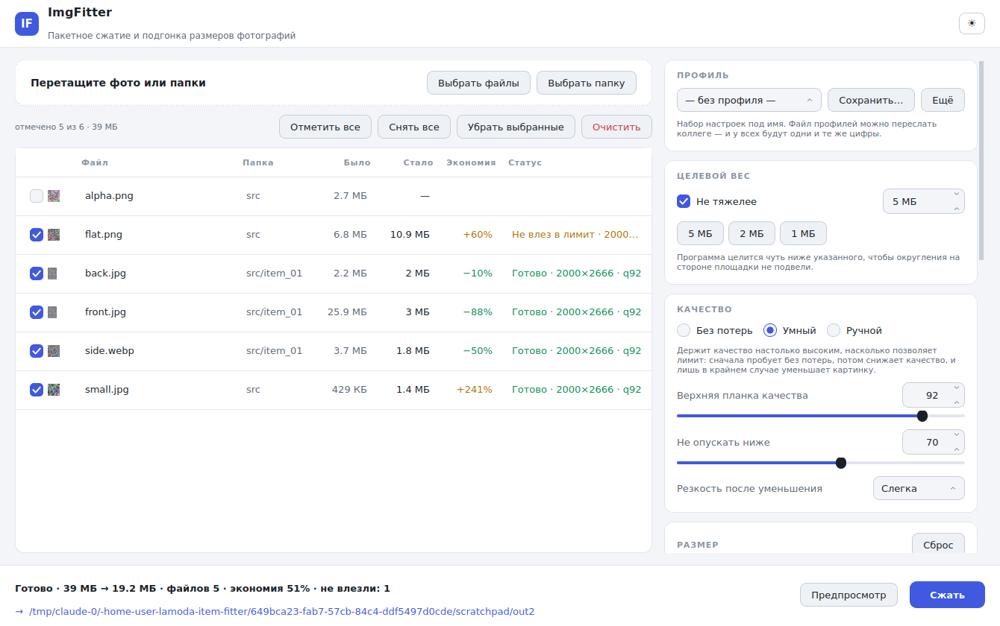

# ImgFitter

Пакетное сжатие и подгонка размеров фотографий. Кидаете папки со съёмкой —
получаете те же папки с файлами нужного веса и ровно того разрешения,
которое просит площадка.

Автор — **Мария Пугачева**, [@mhhhoa](https://github.com/mhhhoa).



<details><summary>Светлая тема</summary>



</details>

## Зачем

Снимок с зеркалки весит 20–30 МБ, а площадки почти всегда ставят потолок —
5 МБ, 2 МБ, у кого как. Плюс требуют конкретные пропорции. Вручную прогонять
сотню карточек через онлайн-сжималки и кадрировать в редакторе — занятие на
вечер. Программа делает это за один клик и старается отдать максимально
возможное качество, а не просто «ужать до упора».

## Как получить

Программа собирается автоматически на GitHub — компилировать ничего не нужно.

1. Откройте вкладку **Actions** в этом репозитории.
2. Выберите последний зелёный запуск «Сборка и тесты».
3. Внизу страницы, в разделе **Artifacts**, скачайте `ImgFitter-windows`.
4. **До распаковки** нажмите на скачанный ZIP правой кнопкой → Свойства →
   внизу галочка **«Разблокировать»** → ОК.
5. Распакуйте архив и запустите `ImgFitter.exe`. Установка не нужна.

Шаг с разблокировкой снимает метку «скачано из интернета», которая иначе
переходит на распакованный exe. Если его пропустить, при первом запуске
появится «Защитник SmartScreen» — файл не подписан сертификатом; тогда
нажмите **Подробнее → Выполнить в любом случае**.

Собрать exe у себя: `build_windows.bat` (нужен Python 3.10+).
Запустить из исходников: `pip install -r requirements.txt && python run.py`.

## Как пользоваться

1. Перетащите в окно файлы или папки — вложенные папки разбираются целиком.
2. Снимите галочки с того, что обрабатывать не надо: по умолчанию отмечено всё.
3. Задайте вес и размер, выберите папку для результата.
4. Нажмите «Сжать».

Оригиналы не трогаются никогда. Даже если указать папку с исходниками как
папку выгрузки, программа добавит к именам номер, а не перезапишет съёмку.
Так же она поступит, если в режиме «всё одной кучей» из разных папок придут
два файла с одинаковым именем.

### Список файлов

Галочка у строки решает, попадёт ли файл в обработку. Кнопки **«Отметить
все»** и **«Снять все»** — над списком. Выделение мышью работает как обычно:
`Ctrl+клик` добавляет строку, `Shift+клик` — диапазон, `Ctrl+A` выделяет всё.
**Пробел** переключает галочки у всего выделения, а клик по галочке внутри
выделения применяется сразу ко всем выделенным строкам.

Двойной клик по строке открывает **предпросмотр до/после**: программа
прогоняет этот файл текущими настройками в памяти и показывает результат со
шторкой, которую можно таскать мышью. Ничего при этом не сохраняется — можно
спокойно подбирать качество.

## Размер на выходе

Три взаимоисключающих режима:

- **Не менять** — разрешение остаётся как в оригинале.
- **Не больше по длинной стороне** — потолок в пикселях, пропорции целы.
- **Точный размер** — ровно те цифры, что вы задали.

В точном режиме ширина и высота связаны цепочкой: правите одну — вторая идёт
следом за выбранными пропорциями. Отключите связку, чтобы вбить обе цифры
руками. Пропорции выбираются из списка — квадрат, восемь пар вертикалей и
горизонталей (4:5 и 5:4, 3:4 и 4:3, 2:3 и 3:2, 5:7 и 7:5, 3:5 и 5:3,
10:16 и 16:10, 9:16 и 16:9, 1:2 и 2:1, 9:21 и 21:9) — или ставится
«Свободно», если цифры нестандартные.

Последние введённые цифры запоминаются до следующего запуска. Кнопка **«Сброс»**
рядом с заголовком возвращает заводские значения.

### Когда пропорции не сошлись

Кадр 3:2 в рамку 3:4 без потерь не влезет, и программа спросит вас заранее,
что делать:

| Режим | Что происходит |
|---|---|
| **Заполнить с обрезкой** | Кадр заполнен целиком, лишнее по длинной стороне срезается. Куда прижимать — задаётся сеткой из девяти клеток. |
| **Вписать целиком** | Фотография видна полностью, свободное место заливается: белым, чёрным, прозрачным, своим цветом или цветом, взятым с краёв самого кадра. |
| **Растянуть** | Кадр натягивается на рамку с искажением пропорций. |

Галочка **«Увеличивать, если фото меньше»** решает судьбу маленьких
исходников. Выключите её — программа всё равно отдаст заданный кадр, но
фотография в нём будет своего размера, а вокруг появятся поля. И в том, и в
другом случае строка списка честно скажет, что произошло.

## Режимы сжатия

| Режим | Что делает | Когда нужен |
|---|---|---|
| **Без потерь** | Перестраивает JPEG компактнее, не меняя ни одного пикселя. Геометрию не трогает вовсе. Экономия 5–15%. | Когда качество трогать нельзя ни при каких условиях. |
| **Умный** | Сначала пробует без потерь. Не хватило — снижает качество, но не ниже заданной планки. Всё ещё не влезает — уменьшает картинку. | Обычный сценарий. Стоит по умолчанию. |
| **Ручной** | Применяет заданное качество и размер, ни под что не подстраиваясь. | Когда нужен предсказуемый результат для всей партии. |

### Про «сжатие без потери качества»

Честное lossless-сжатие JPEG даёт всего 5–15%: файл на 25 МБ так до 5 МБ не
ужать никаким алгоритмом. Дальше выбор один — жертвовать либо качеством,
либо разрешением. Умный режим выстраивает эти жертвы по возрастанию боли:
бесплатная lossless-оптимизация, затем ограничение размера, затем плавное
снижение качества и лишь в крайнем случае дополнительное уменьшение.

Если сохранить пиксели невозможно — снимок нужно развернуть по EXIF,
пересчитать в sRGB или перевести в другой формат, — файл всё равно
сохраняется на максимуме качества, но помечается статусом **«без потерь не
вышло»** с указанием причины. Молча подменять обещанное пережатием программа
не станет.

## Профили

Набор настроек можно сохранить под именем и переключать одним кликом:
«Озон 3:4», «Квадрат 1:1», «Инстаграм 4:5». Профили лежат отдельным файлом,
который экспортируется и импортируется через меню **«Ещё»** — присылаете коллеге,
и у всей команды одинаковые цифры.

Папка выгрузки и тема оформления в профиль не попадают: это про рабочее
место, а не про задачу.

## Имена файлов

Галочка **«Переименовать по шаблону»** открывает поле, где работают
подстановки:

| Подстановка | Что подставит |
|---|---|
| `{name}` | Исходное имя без расширения |
| `{folder}` | Имя папки, в которой лежал файл |
| `{n}`, `{n2}`, `{n3}`, `{n4}` | Порядковый номер, с нужным числом ведущих нулей |
| `{w}`, `{h}` | Ширина и высота результата |

Например, `{folder}_{n3}` даст `dress_blue_001.jpg`, `dress_blue_002.jpg`.
Нумерация идёт по порядку списка и стартует с числа, заданного рядом.

## Форматы

**Читает:** JPEG, PNG, WebP, AVIF, HEIC/HEIF (съёмка с айфона), TIFF, BMP, GIF.

**Сохраняет:** JPEG, PNG, WebP, AVIF или «как в оригинале». В режиме «как в
оригинале» JPEG остаётся JPEG, а форматы, которые площадки не принимают
(HEIC, TIFF, BMP), автоматически становятся JPEG.

PNG сжимается только без потерь, поэтому в жёсткий лимит попадает не всегда —
для фотографий выбирайте JPEG.

## Что ещё делает программа

- **Возвращает резкость после уменьшения** — любое уменьшение усредняет
  пиксели и мылит фактуру ткани; аккуратный unsharp её возвращает. Три
  положения: выключена, слегка, заметно.
- **Разворачивает по EXIF** — снимки с телефона не лягут набок.
- **Приводит цвета к sRGB** — фотографии в Adobe RGB иначе выглядят на сайте
  блёкло, потому что площадка не читает цветовой профиль.
- **Чистит метаданные** — минус несколько сотен килобайт на файл и минус
  геометка с адресом съёмки. Отключается галочкой.
- **Не раздувает файлы** — если после пережатия файл стал тяжелее оригинала,
  сохраняется оригинал.
- **Не пропускает битые файлы** — пустышка или текстовый файл с расширением
  .jpg получат статус ошибки, а не уедут в выгрузку под видом фотографии.
  Одна такая ошибка не останавливает всю очередь.
- **Работает в несколько потоков** — по числу ядер процессора.
- **Умеет светлую тему** — переключатель в правом верхнем углу.
- **Проверяет саму себя** — `ImgFitter.exe --selftest отчёт.txt` прогоняет
  ресурсы, чтение HEIC, сжатие без потерь и запуск окна и пишет отчёт. Это же
  делает сборка на каждый коммит, поэтому неполная упаковка не доедет до вас
  незамеченной.

Настройки запоминаются между запусками.

## Разработка

```bash
python -m venv .venv && source .venv/bin/activate
pip install -r requirements.txt pytest
python run.py
QT_QPA_PLATFORM=offscreen pytest tests -q
```

Структура:

```
app/core/       логика сжатия и геометрии, без Qt — её можно дёргать из скриптов
app/ui/         окно, таблица файлов, панель настроек, предпросмотр, оформление
app/pipeline.py очередь и потоки
tests/          тесты ядра, геометрии, раскладки файлов, интерфейса и сквозного прогона
```

Название, версия и авторство лежат в `app/__init__.py` — оттуда их читают
окно, заставка и свойства exe.
